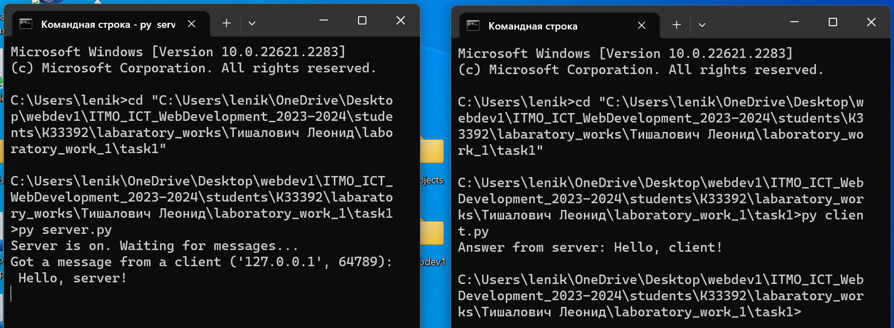

# Задание 1

Реализовать клиентскую и серверную часть приложения. Клиент отсылает серверу
сообщение «Hello, server». Сообщение должно отразиться на стороне сервера.
Сервер в ответ отсылает клиенту сообщение «Hello, client». Сообщение должно
отобразиться у клиента.

Обязательно использовать библиотеку socket

Реализовать с помощью протокола UDP

## Ход выполнения работы

### Код server.py

    import socket

    server_socket = socket.socket(socket.AF_INET, socket.SOCK_DGRAM)

    server_address = ('localhost', 1234)
    server_socket.bind(server_address)

    print('Server is on. Waiting for messages...')

    while True:
        message, client_address = server_socket.recvfrom(1024)

        print(
            f'Got a message from a client {client_address}: {message.decode()}')

        response = 'Hello, client!'
        server_socket.sendto(response.encode(), client_address)

### Код client.py

    import socket

    client_socket = socket.socket(socket.AF_INET, socket.SOCK_DGRAM)

    server_address = ('localhost', 1234)

    message = 'Hello, server!'
    client_socket.sendto(message.encode(), server_address)

    response, _ = client_socket.recvfrom(1024)

    print(f'Answer from server: {response.decode()}')

    client_socket.close()

## Результат

